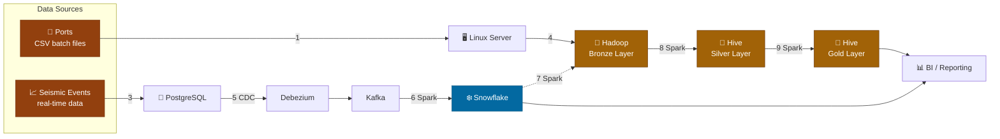
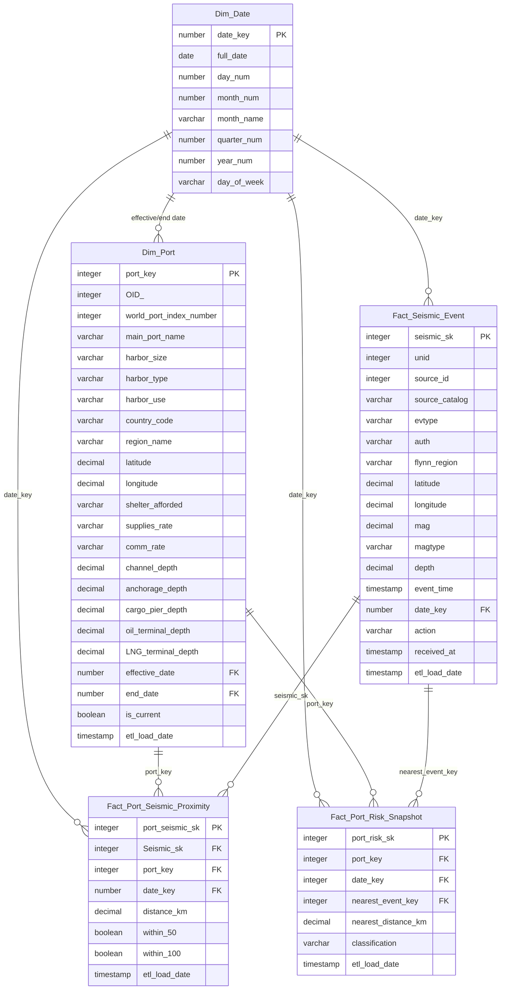
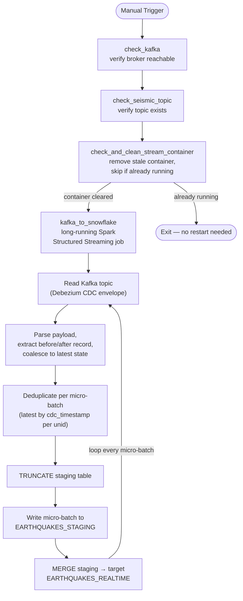

# TidaLine — Maritime Logistics Data Pipeline

TidaLine is a Docker-based data engineering case study that ingests port, and seismic (earthquake) data through both batch and real-time paths, processes it through a lambda architecture, and serves it to Snowflake and a BI layer for maritime risk analysis (e.g. assessing earthquake proximity/risk to ports).

---

## 1. Architecture


---

**Orchestration:** Apache Airflow · **Versioning:** GitHub · **Runtime:** Docker

- **Batch path** — Ports CSV files land on a Linux staging server, then get pulled into HDFS as the Bronze layer.
- **Real-time path** — Seismic events are written to PostgreSQL, captured via Debezium CDC, streamed through Kafka, and written directly to Snowflake by a Spark Structured Streaming job (`kafka_to_snowflake.py`) — Kafka never lands in HDFS.
- **Batch transformation** — Spark jobs progressively refine Bronze → Silver → Gold using Hive as the query/storage layer.
- **Serving** — Both the Gold layer (batch) and Snowflake (real-time) feed the BI/reporting layer.

---

## 2. Data Model (Star Schema)



**Design notes:**
- `Dim_Port` is a **slowly changing dimension** (`effective_date`, `end_date`, `is_current`) — port attributes like depth or harbor size can change over time and history is preserved.
- `Fact_Seismic_Event` is the **grain-level fact** — one row per earthquake event, deduplicated on `unid`.
- `Fact_Port_Seismic_Proximity` is a **bridge/proximity fact** connecting ports to nearby seismic events with distance flags (`within_50`, `within_100` km).
- `Fact_Port_Risk_Snapshot` is a **periodic snapshot fact** — one row per port per date, summarizing the nearest event and a derived risk `classification`.

---

## 3. Pipeline Workflow (Airflow DAG)



**Key behavior:**
- `dag_id`: `tidaline_seismic_realtime`, `schedule=None` — manually triggered only, `max_active_runs=1`.
- The final task (`kafka_to_snowflake`) never "completes" in the normal sense — it's a continuously running streaming query (`awaitTermination()`), so once triggered it stays in a `running` state in Airflow until the container is stopped.
- The MERGE-based upsert means late-arriving updates to an earthquake record (e.g. magnitude revisions) correctly overwrite the existing row instead of duplicating it.

---

## 4. Feature Breakdown

| Component | Role in the pipeline |
|---|---|
| **Docker** | Runs every service (Postgres, Kafka, Hadoop, Spark, Airflow) as isolated, reproducible containers on one network. |
| **PostgreSQL** | Source-of-truth database for real-time seismic event ingestion. |
| **Debezium** | Captures row-level changes (insert/update/delete) from Postgres via CDC and publishes them as Kafka events, without querying the source table directly. |
| **Kafka** | Durable, ordered message bus decoupling the CDC producer from the Spark consumer — allows replay and backpressure handling. |
| **Spark Structured Streaming** | Reads the Kafka topic continuously, parses the Debezium envelope, deduplicates, and writes to Snowflake in near real time (10s micro-batches). |
| **Snowflake** | Cloud data warehouse serving as the real-time analytical target (`EARTHQUAKES_REALTIME`) via a staging-table + MERGE upsert pattern. |
| **Hadoop / HDFS (Bronze)** | Landing zone for raw batch data (ports, vessels-in-scope sources) before any transformation. |
| **Hive (Silver/Gold)** | Structured, query-able layers built on top of Bronze via Spark batch jobs — Silver cleans/conforms data, Gold aggregates it for reporting. |
| **Apache Airflow** | Orchestrates the pipeline: health checks, container lifecycle management, and triggering the long-running streaming job. |
| **GitHub** | Version control for all DAGs, Spark jobs, and configuration. |
| **Star Schema (Dim/Fact tables)** | Models the business question "how close is this earthquake to this port, and how risky is that?" — combining a slowly changing port dimension, an event-grain fact, a proximity bridge fact, and a daily risk snapshot fact. |

---

## 5. Known Operational Notes

- The streaming job's checkpoint (`/opt/checkpoints/kafka_to_snowflake`) must be mounted **writable** — it must not share a path with the read-only `spark/jobs` mount.
- `startingOffsets` is `latest` by default, meaning a restarted stream will **not** backfill messages produced while it was down — only newly arriving Kafka messages are processed.
- The Snowflake password is injected via an Airflow Variable (`{{ var.value.snowflake_password }}`) and read from the `SNOWFLAKE_PASSWORD` environment variable in the Spark job — it is never committed to source control.

---

## 6. How to Test

### 6.0 Set up the Snowflake password as an Airflow Variable (UI)

Before the DAG can connect to Snowflake, the `snowflake_password` Variable must exist — the DAG references it as `{{ var.value.snowflake_password }}` and the Spark job reads it from the `SNOWFLAKE_PASSWORD` environment variable.

1. Open the Airflow web UI (default: `http://localhost:8080`).
2. Go to **Admin → Variables** in the top navigation bar.
3. Click the **+** (blue plus) button to add a new record.
4. Fill in:
   - **Key:** `snowflake_password`
   - **Val:** your actual Snowflake password
   - **Description** *(optional)*: `Password for Snowflake connection used by kafka_to_snowflake DAG`
5. Click **Save**.

You should now see `snowflake_password` listed under Admin → Variables, with its value masked (`***`) in the UI for security. This keeps the password out of the DAG file and out of Git entirely — the DAG only ever references it by key.

> To update the password later, click the row's edit (pencil) icon under Admin → Variables and save the new value — no DAG code changes needed.

### 6.1 Test and trigger from the Airflow UI

1. Open the Airflow UI and locate `tidaline_seismic_realtime` in the DAGs list.
2. Toggle the DAG **On** (the switch on the left of its row) if it isn't already — this only enables it for use, it will **not** run automatically since `schedule=None`.
3. Click the **▶ Trigger DAG** button (top right of the DAG's page, or the play icon on its row).
4. Open the DAG's **Graph** view to watch tasks execute in order: `check_kafka → check_seismic_topic → check_and_clean_stream_container → kafka_to_snowflake`. Each task turns dark green when it succeeds.
5. Click on the `kafka_to_snowflake` task box, then **Logs**, to see the live Spark output (dependency resolution, Kafka connection, and each micro-batch's MERGE result).
6. This last task will stay **blue/running** indefinitely — that's expected for a streaming job, not a stuck task. To stop it, use **Clear** or manually stop the container (`docker stop airflow_kafka_to_snowflake`) as covered earlier in this README.
7. If a task fails, click it → **Logs** to see the traceback, or check **Admin → Variables** first if the failure is a Snowflake authentication error (usually means the Variable above is missing or has a stale password).

---

**1. Bring up the stack**
```bash
docker compose up -d
```
Confirm all containers are healthy: `docker ps` (Postgres, Kafka, Debezium/Connect, Hadoop, Spark, Airflow should all be `Up`).

**2. Verify Kafka + CDC are wired correctly**
```bash
docker exec -it kafka kafka-topics --bootstrap-server kafka:29092 --list
```
Confirm `earthquicks-cdc.public.earthquakes` appears in the list.

**3. Insert a test row into Postgres**
```sql
INSERT INTO earthquakes (unid, source_id, source_catalog, lastupdate, time, flynn_region, lat, lon, depth, evtype, auth, mag, magtype, action, received_at)
VALUES (999001, 1, 'TEST', extract(epoch from now())*1000000, extract(epoch from now())*1000000, 'Test Region', 30.5, 31.2, 10.0, 'ke', 'TEST', 4.5, 'mb', 'insert', extract(epoch from now())*1000000);
```

**4. Confirm the message reached Kafka**
```bash
docker exec -it kafka kafka-console-consumer --bootstrap-server kafka:29092 --topic earthquicks-cdc.public.earthquakes --from-beginning --max-messages 1
```

**5. Trigger the DAG**
- UI: **Airflow → tidaline_seismic_realtime → Trigger DAG**
- CLI: `airflow dags trigger tidaline_seismic_realtime`

Watch `check_kafka` → `check_seismic_topic` → `check_and_clean_stream_container` → `kafka_to_snowflake` turn green in sequence. The last task stays in `running` state — that's expected for a streaming job.

**6. Check the Spark container logs for a successful micro-batch**
```bash
docker logs airflow_kafka_to_snowflake --tail 100
```
Look for a completed `MERGE` with no `ERROR` lines.

**7. Query Snowflake to confirm the test row landed**
```sql
SELECT *
FROM EARTHQUAKES_REALTIME
WHERE UNID = 999001;
```

**8. Test the update path (MERGE logic)**
```sql
UPDATE earthquakes SET mag = 5.1 WHERE unid = 999001;
```
Re-run the Snowflake query — `MAG` should now read `5.1` with the same `UNID`, confirming the upsert (not a duplicate insert) worked.

**9. Clean up the test row**
```sql
DELETE FROM earthquakes WHERE unid = 999001;
```

---

## 7. Contributors

- [Salma Algayar](https://www.linkedin.com/in/salma-algayar-data-managemant/)
- [Roaa Talat](https://www.linkedin.com/in/roaa-talat/)
- [Farah Elyamany](https://www.linkedin.com/in/farahelyamanyy/)
- [Mariam Taha](https://www.linkedin.com/in/mariiamtaha/)
